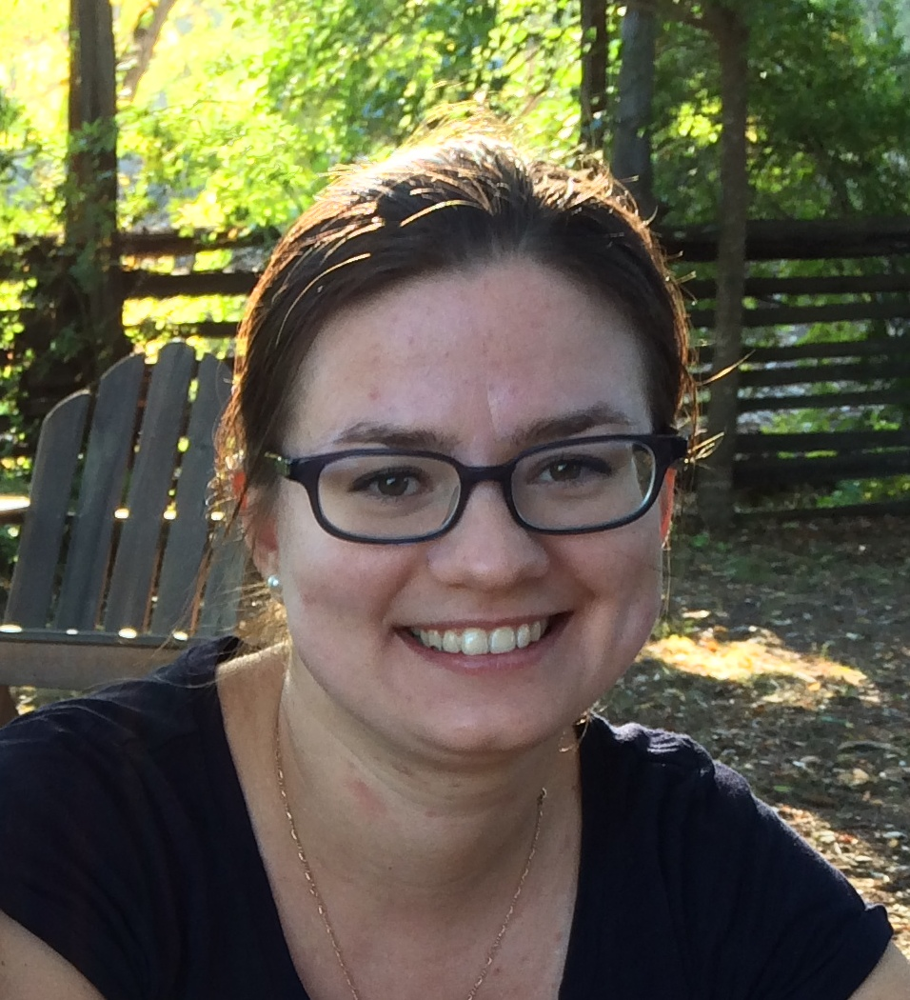
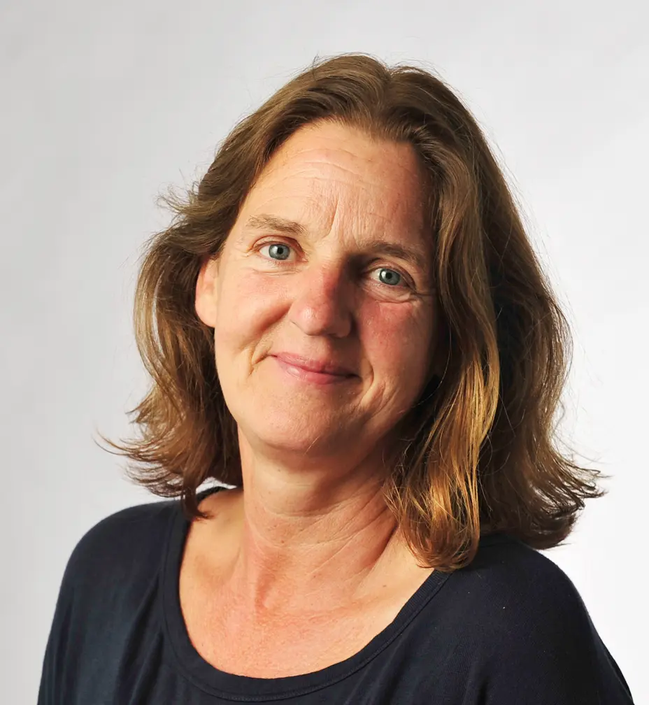

# The Second Workshop on Analogical Abstraction in Cognition, Perception, and Language (Analogy-Angle II)

> Explore, model, and understand analogical reasoning in cognition, language, and computational models from an interdisciplinary perspective

**Analogy-Angle II** is a multidisciplinary workshop to advance research on analogical abstraction by bridging the fields of computational linguistics, artificial intelligence, and cognitive psychology. This workshop seeks to foster collaboration among researchers by providing a platform for sharing novel insights, benchmarks, methodologies, and analogy applications across disciplines. **Analogy-Angle II** welcomes diverse contributions, including original research, reviews, and previously accepted papers from leading conferences.
[Analogy-Angle I](https://analogy-angle.github.io/2024) was co-located with IJCAI 2024.

## Confirmed Keynote Speakers

    <figure style="display: inline-block;">
	
        <figcaption style="text-align: center;"><a href="https://melaniemitchell.me/"><strong>Melanie Mitchell</strong></a>  Santa Fe Institute</figcaption>
    </figure>
    <figure style="display: inline-block;">
	
        <figcaption style="text-align: center;"><a href=""><strong>Ekaterina Shutova</strong></a>  University of Amsterdam</figcaption>
    </figure>

## Topics
We invite contributions ranging from cognitive modeling and algorithms and methods to new tasks and new applications of analogy. Contributions that take an **interdisciplinary** perspective are particularly encouraged. Topics include (but are not limited to) the following: 

* **Cognitive modeling**
	* Analogy and abstraction
	* Analogy and conceptual metaphor
	* Analogy, figurative language, sarcasm, and irony
	* Cognitive frameworks of analogy
	* Cognitive/psychological studies on analogy involving human participants
* **Algorithms and methods**
	* Studies of the analogical abilities of large language models and visual diffusion models
	* Algorithmic approaches to analogy
	* Augmentation and verification of large language and vision models through analogy
	* Neuro-symbolic AI architectures for analogical abstraction
	* Extracting analogies from knowledge bases
* **Tasks and benchmarks**
	* Matching narratives and situational descriptions through narratives
	* Novel tasks and benchmarks for evaluating analogies in text and vision
	* Analogy in longer formats, e.g., narratives and videos
	* Analogy and visual abstraction tasks
	* Analogical discovery and computational creativity
* **Applications**
	* Analogies for personalization, explanation, and collaboration
	* Novel applications of analogical abstraction
	* Studies of the impact of analogy in specific applications and domains, including education, innovation, and law

## Submissions

Submissions can fall into one of the following categories : 

1. **Full Research Papers (up to 8 pages plus 2 pages for references)** - Papers with original research work which will be judged on their technical soundness and rigor, though allowances made for novel or experimental directions. We also welcome submissions reporting negative results and sharing experimental insights on the technical challenges and issues of analogical abstraction. 

2. **Short Papers (up to 4 pages)** - Position papers or reports of ongoing work on new research directions.

3. **Dissemination Papers** - Already published papers from top AI venues such as ACL, EMNLP, IJCAI, NeurIPS, AAAI, ICML, and ICLR that are relevant to the workshop. Please upload the original submission and abstract to our submission site. **Please indicate where the paper has been accepted as a first sentence in the abstract.**

Full and short research papers will be peer-reviewed by at least two reviewers from the PC. Accepted full and short papers will be included in the proceedings of the workshop. 
Dissemination papers will go through a short review from the organizers, checking for their quality and relevance to the workshop. Dissemination papers will not be included in the workshop proceedings.

Please submit your contribution via [Open Review](https://openreview.net/group?id=aclweb.org/ACL/2025/Workshop/Analogy-ANGLE).
The paper type will be inferred based on the submission length. Submissions should be **anonymized**, and the review will be double-blind. Preprints can be stored on arXiv.

Please format your full and short papers using the [ACL template](https://aclrollingreview.org/cfp#paper-submission-and-templates). Dissemination papers can be submitted in their original format.

We favor in-person presentations of the accepted works. However, in cases where this is not possible, we will accommodate remote presentations.

## Important Dates
* First call for workshop papers: December 19, 2024
* Second call for workshop papers: January 24, 2025
* Third call for workshop papers: February 24, 2025
* Direct submission deadline: March 1, 2025
* Pre-reviewed (ARR) submission deadline: March 25, 2025
* Notification of acceptance: April 17, 2025
* Camera-ready paper deadline: May 16, 2025
* Proceedings due (hard deadline): June 30, 2025
* Pre-recorded video due (hard deadline): July 7, 2025
* Workshop dates: July 31st - August 1st 2025

All deadline times are **23:59 anywhere on Earth**.

## Chairs

    <figure style="display: inline-block;">
	
        <figcaption style="text-align: center;"><a href="https://www.ilievski.info"><strong>Filip Ilievski</strong></a>  VU Amsterdam  Commonsense reasoning,  Natural language processing</figcaption>
    </figure>
    <figure style="display: inline-block;">
	
        <figcaption style="text-align: center;"><a href=""><strong>Giulia Rambelli</strong></a>  University of Bologna Computational linguistics,  Natural language processing</figcaption>
    </figure>
	<figure style="display: inline-block;">
	
        <figcaption style="text-align: center;"><a href="https://www.unibo.it/sitoweb/m.bolognesi/en"><strong>Marianna Bolognesi</strong></a>  University of Bologna Cognitive linguistics,  Computational creativity</figcaption>
    </figure>

	<figure style="display: inline-block;">
	
        <figcaption style="text-align: center;"><a href="https://www.uni-bamberg.de/kogsys/team/schmid-ute"><strong>Ute Schmid</strong></a>  University of Bamberg Cognitive science,  Interpretable ML</figcaption>
    </figure>
    <figure style="display: inline-block;">
	
        <figcaption style="text-align: center;"><a href="https://piasommerauer.github.io"><strong>Pia Sommerauer</strong></a>  VU Amsterdam Computational linguistics,  Natural language processing</figcaption>
    </figure>

Contact: **analogy-angle@groups.google.com**

## Program Committee

1. David Cerna (University of Prague)
2. Frank Guerin (University of Surrey)
3. Yifan Jiang (University of Southern California)
4. Sundong Kim (GIST Korea)
5. Antonio Lieto (University of Salerno)
6. Henri Prade (CNRS)
7. Zeynep G. Saribatur (Vienna University of Technology)
8. Hwanjun Song (KAIST)
9. Zhivar Sourati (University of Southern California)
10. Philipp Wicke (Ludwig Maximilian University)
11. Cas Coopmans (Donders Institute for Brain, Cognition and Behavior, Radboud Universiteit Nijmegen)
12. Eunice Yiu (UC Berkeley)

## Workshop Registration
Workshop registration is through the ACL website. 

## Background

Analogical abstraction is a fundamental cognitive skill unique to humans (Penn et al., 2008; Hofstadter, 2001), defined as the ability to perceive and utilize the similarities between concepts, situations or events based on (systems of) relations rather than surface similarities (Holyoak, 2012; Gentner et al., 2012). Analogy enables creative inferences, explanations, and generalization of knowledge, and has been used for scientific inventions (Dunbar and Klahr, 2012), solving problems (Gick and Holyoak, 1980), and policy-making (Houghton, 1998). As such, it has been the goal of one of the first AI programs developed by Evans (1964). It has also been the subject of cognitive theories and studies about humans for common processes, such as the retrieval of memories (Wharton et al., 1994) and problem-solving (Gick and Holyoak, 1980), mostly leveraging narratives as their experimental medium (Gentner and Toupin, 1986; Gentner et al., 1993; Wharton et al., 1994), given their multi-tiered nature and potential for abstraction. 

Meanwhile, analogical tasks have also been a relatively popular topic in natural language processing (NLP) and artificial intelligence (AI), typically framed as intelligence tests for models compared against humans. So-called word-based, proportional analogies of the form (A : B :: C : D) (Mikolov et al., 2013a,b; Gladkova et al., 2016; Ushio et al., 2021) are often used to measure the potential of word embeddings and language models. Recent studies (Webb et al., 2023) show a strong ability of state-of-the-art (SOTA) large language models (LLMs) to discover proportional word analogies, though this skill degrades with higher complexity (Wijesiriwardene et al., 2023) or when controlling for association-based answers (Stevenson et al., 2023). Shifting toward more complex settings, narrative-based analogy benchmarks that involve system mappings rather than simple word-based relational mappings have been also been considered recently, with limitations in scope, generalizability, and alignment with cognitive theories (Nagarajah et al., 2022; Wijesiriwardene et al., 2023; Sourati et al., 2023). Meanwhile, given the potential of large language and visual models, another line of research aims to study their ability to draw analogies consistently (cf., Webb et al., 2023). Given the richness of analogical abstraction and the wide interest in this topic from artificial intelligence, linguistics, and cognitive psychology, it is important to connect these communities and facilitate cross-disciplinary activities.

**Prior events:** [The first iteration of Analogy-Angle](https://analogy-angle.github.io/2024) was co-located with IJCAI 2024 in Jeju, South Korea. The workshop received 11 submissions in total (6 novel and 5 dissemination papers). 7 of these papers were accepted, consisting of 3 novel and 4 dissemination papers. The dissemination papers were published within a year prior to the workshop in ACL, TACL, EMNLP, and NAACL. Besides papers, the workshop included two keynote talks by Ken Forbus and Tony Veale and a panel that included the keynote speakers and the paper presenters. The workshop participation was in-person only. It had a steady amount of 30 active participants, and featured many discussions during the talks and over the social activities. The organizing committee of the first iteration of the workshop consisted of 20\% men and 80\% women.

Dunbar, K.N. and Klahr, D., 2012. Scientific thinking and reasoning.  In Keith J Holyoak and Robert G Morrison, editors, Oxford handbook of thinking and reasoning, page 701–718.

Evans, T.G., 1964. A program for the solution of a class of geometric-analogy intelligence-test questions (No. 64). Air Force Cambridge Research Laboratories, Office of Aerospace Research, United States Air Force.

Gentner, D., Smith, L. and Ramachandran, V.S., Analogical Reasoning, 2012. Encyclopedia of Human Behavior, 2nd ed., VS Ramachandran, ed., Elsevier, Oxford, UK, pp.130-136.

Gentner, D. and Toupin, C., 1986. Systematicity and surface similarity in the development of analogy. Cognitive science, 10(3), pp.277-300.

Gentner, D., Rattermann, M.J. and Forbus, K.D., 1993. The roles of similarity in transfer: Separating retrievability from inferential soundness. Cognitive psychology, 25(4), pp.524-575.

Gick, M.L. and Holyoak, K.J., 1980. Analogical problem solving. Cognitive psychology, 12(3), pp.306-355.

Gladkova, A. and Drozd, A., 2016, August. Intrinsic evaluations of word embeddings: What can we do better?. In Proceedings of the 1st Workshop on Evaluating Vector-Space Representations for NLP (pp. 36-42).

Hofstadter, D.R., 2001. Analogy as the core of cognition. The analogical mind: Perspectives from cognitive science, pp.499-538.

Holyoak, K.J., 2012. Analogy and relational reasoning. The Oxford handbook of thinking and reasoning, pp.234-259.

Houghton, D.P., 1998. Analogical reasoning and policymaking: Where and when is it used?. Policy Sciences, 31(3), pp.151-176.

Mikolov, T., Chen, K., Corrado, G. and Dean, J., 2013a. Efficient estimation of word representations in vector space. arXiv preprint arXiv:1301.3781.

Mikolov, T., Sutskever, I., Chen, K., Corrado, G.S. and Dean, J., 2013b. Distributed representations of words and phrases and their compositionality. Advances in neural information processing systems, 26.

Nagarajah, T., Ilievski, F. and Pujara, J., 2022. Understanding narratives through dimensions of analogy. IJCAI workshop on Qualitative Reasoning.

Penn, D.C., Holyoak, K.J. and Povinelli, D.J., 2008. Darwin's mistake: Explaining the discontinuity between human and nonhuman minds. Behavioral and brain sciences, 31(2), pp.109-130.

Stevenson, C.E., ter Veen, M., Choenni, R., van der Maas, H.L. and Shutova, E., 2023. Do large language models solve verbal analogies like children do?. arXiv preprint arXiv:2310.20384.

Sourati, Z., Ilievski, F. and Sommerauer, P., 2024. ARN: A Comprehensive Framework and Dataset for Analogical Reasoning on Narratives. TACL.

Ushio, A., Espinosa-Anke, L., Schockaert, S. and Camacho-Collados, J., 2022, March. BERT is to NLP what AlexNet is to CV: Can Pre-Trained Language Models Identify Analogies?. In ACL 2022 Workshop on Commonsense Representation and Reasoning.

Webb, T., Holyoak, K.J. and Lu, H., 2023. Emergent analogical reasoning in large language models. Nature Human Behaviour, 7(9), pp.1526-1541.

Wharton, C.M., Holyoak, K.J., Downing, P.E., Lange, T.E., Wickens, T.D. and Melz, E.R., 1994. Below the surface: Analogical similarity and retrieval competition in reminding. Cognitive Psychology, 26(1), pp.64-101.

Wijesiriwardene, T., Sheth, A., Shalin, V.L. and Das, A., 2023. Why Do We Need Neurosymbolic AI to Model Pragmatic Analogies?. IEEE Intelligent Systems, 38(5), pp.12-16.

